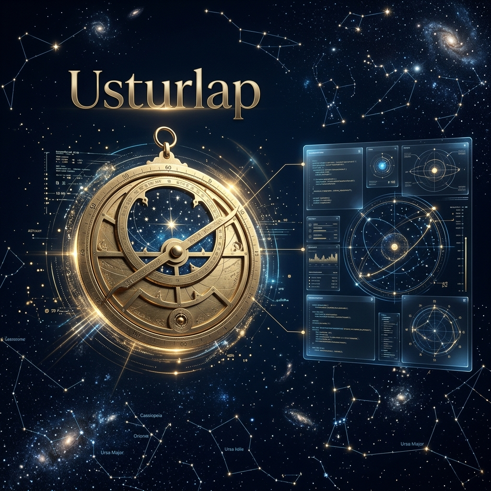

# 🔭 Usturlap (Astrolabe)

[](https://opensource.org/licenses/MIT)
[](https://www.python.org/)
[](https://fastapi.tiangolo.com/)
[](https://www.docker.com/)

**Usturlap**, geliştiriciler, veri bilimciler ve profesyonel astrologlar için tasarlanmış **egemen (sovereign)**, yüksek performanslı ve açık kaynaklı bir astrolojik hesaplama ekosistemidir.

Binlerce yıllık kadim bilgeliği modern yazılım mimarisiyle birleştiren bu proje, endüstri standardı olan **Swiss Ephemeris** verilerini temel alarak en karmaşık astrolojik teknikleri saniyeler içinde hesaplar ve bunları yüksek yoğunluklu JSON formatında sunar.

---

## 💎 Egemen Özellikler (Sovereign Features)

Usturlap, basit bir gökyüzü haritasının çok ötesine geçerek profesyonel bir analiz platformu sunar:

### 1. İleri Düzey Analiz Motoru
*   **Temel Asaletler (Essential Dignities):** Rulership, Exaltation, Detriment ve Fall hesaplamalarıyla gezegen güçlerinin matematiksel analizi.
*   **Almuten Figuris:** Ibn Ezra sistemine dayalı, haritanın gerçek yöneticisinin (Almuten) tespiti.
*   **Orta Noktalar (Midpoints):** Tüm gezegen çiftleri için hassas orta nokta hesaplamaları.
*   **Arap Noktaları (Lots):** Pars Fortuna (Şans Noktası), Pars Spiritus (Ruh Noktası) ve 20+ yaşam alanı noktası.

### 2. Öngörü ve Gelecek Analizi
*   **Secondary Progressions:** "Bir gün bir yıl" tekniği ile öngörüsel haritalar.
*   **Solar Returns:** Güneş Dönüşü haritalarının astronomik hassasiyetle tespiti.
*   **Solar Arc Directions:** Güneş arkına dayalı tüm gezegen hareketleri.
*   **Transit Motoru:** Anlık gökyüzü konumlarının natal harita üzerindeki etkileri.

### 3. Ezoterik ve Geleneksel Derinlik
*   **Sabian Sembolleri:** Her derecenin arketiüsel ve sembolik anlamlarının entegrasyonu.
*   **Sabit Yıldızlar (Fixed Stars):** 50+ önemli sabit yıldızın gezegenlerle olan temas analizi.
*   **Ay Durakları (Lunar Mansions):** 28 menzilin (Manazil) hassas tespiti.
*   **Harmonik Haritalar:** 9. Harmonik (Navamsa) ve diğer tüm harmonik serilerin üretimi.

### 4. Modern ve Teknik Yetenekler
*   **Astro-Cartography:** Coğrafi lokasyon bazlı gezegen hatlarının (MC/AC/IC/DC) haritalanması.
*   **Heliocentric Desteği:** Güneş merkezli koordinat sistemi seçeneği.
*   **Astro-AI:** LLM (OpenAI/Gemini) uyumlu veri yapıları ve entegre yorumlama scaffolding'i.

---

## 🏗️ Proje Mimarisi

```text
usturlap/
├── app/
│   ├── api/v1/         # Sovereign REST Endpoints
│   ├── models/         # High-density Pydantic Models
│   ├── services/       # Core Calculation Engines (Progressions, Lots, AI)
│   └── main.py         # Entry Point
├── .github/            # CI/CD & Governance
├── tests/              # Pytest Suite
└── Dockerfile          # Production Build
```

---

## 🚀 Kurulum ve Çalıştırma

### Docker ile Çalıştırma (Önerilen)
```bash
git clone https://github.com/arch-yunus/usturlap.git
cd usturlap
docker-compose up -d --build
```

Sunucu çalıştıktan sonra [http://localhost:8000/docs](http://localhost:8000/docs) adresinden Swagger UI üzerinden tüm egemen özelliklere erişebilirsiniz.

---

## 🗺️ Yol Haritası (Roadmap)

- [x] Gelişmiş Ephemeris motoru ve yönlendirme
- [x] Docker ve CI/CD entegrasyonu (Python Tests Workflow)
- [x] Transit ve Sinastri algoritmaları
- [x] `Astro-AI`: LLM yorumlama katmanı
- [x] Öngörü Sistemleri (Solar Return, Progressions, Solar Arcs)
- [x] Geleneksel Teknikler (Lots, Almuten, Lunar Mansions)
- [x] Esoterik Modüller (Fixed Stars, Sabian Symbols, Harmonics)
- [ ] Görselleştirme Kütüphanesi (SVG/Canvas Chart Drawing)

---

## 🤝 Katkıda Bulunma

Astroloji, matematik veya Python seviyorsanız katkılarınızı bekliyoruz! Lütfen önce `CONTRIBUTING.md` dosyasını okuyun.

## 📜 Lisans

Bu proje **MIT Lisansı** ile lisanslanmıştır.
